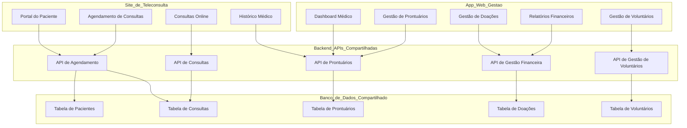

# analiseONG

```mermaid

graph TD
    subgraph Site_de_Teleconsulta
        S1[Portal do Paciente]
        S2[Agendamento de Consultas]
        S3[Histórico Médico]
        S4[Consultas Online]
    end

    subgraph App_Web_Gestao
        A1[Dashboard Médico]
        A2[Gestão de Prontuários]
        A3[Gestão de Doações]
        A4[Gestão de Voluntários]
        A5[Relatórios Financeiros]
    end

    subgraph Backend_APIs_Compartilhadas
        API1[API de Agendamento]
        API2[API de Prontuários]
        API3[API de Consultas]
        API4[API de Gestão Financeira]
        API5[API de Gestão de Voluntários]
    end

    subgraph Banco_de_Dados_Compartilhado
        DB1[Tabela de Pacientes]
        DB2[Tabela de Consultas]
        DB3[Tabela de Prontuários]
        DB4[Tabela de Doações]
        DB5[Tabela de Voluntários]
    end

    S1 --> API1
    S2 --> API1
    S3 --> API2
    S4 --> API3
    A1 --> API2
    A2 --> API2
    A3 --> API4
    A4 --> API5
    A5 --> API4

    API1 --> DB2
    API2 --> DB3
    API3 --> DB2
    API4 --> DB4
    API5 --> DB5
    API1 --> DB1


```
