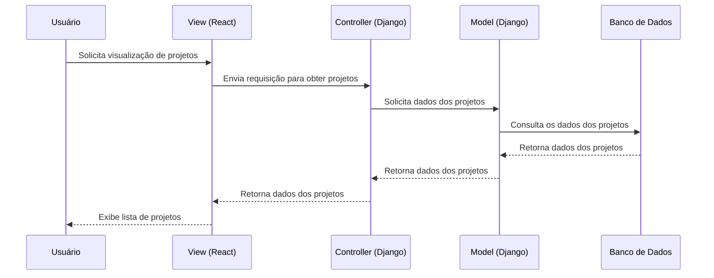
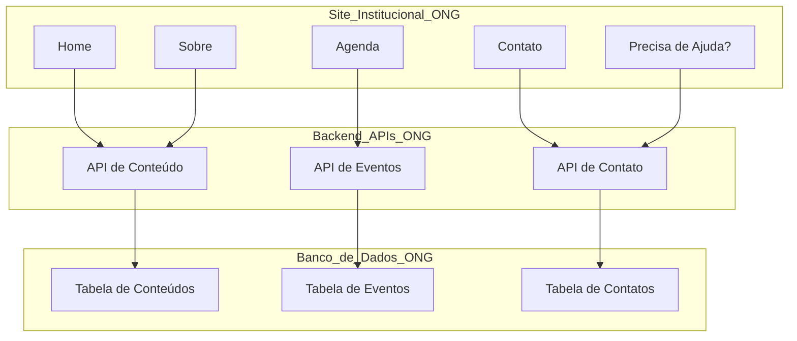
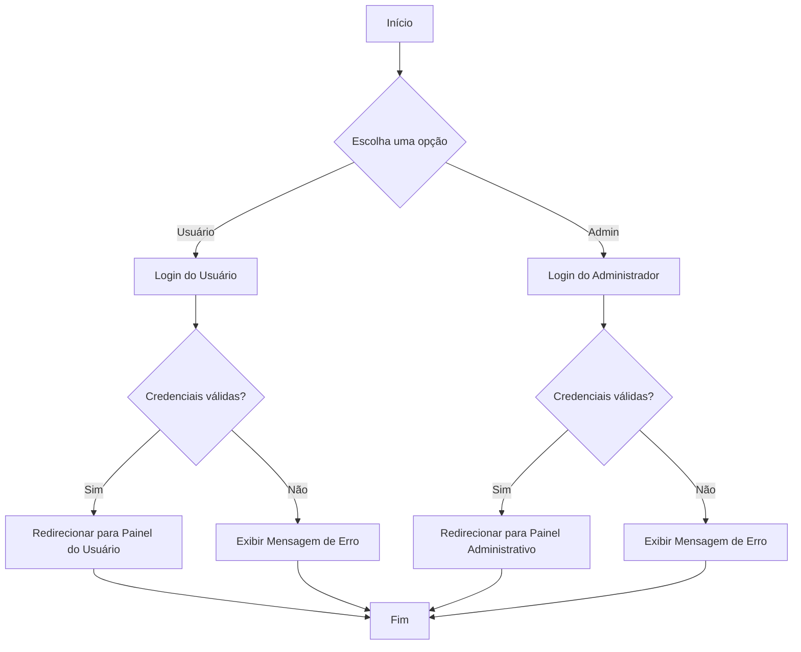

# Guia de Desenvolvimento e Estruturação do Site Institucional da ONG Gabriel

**Objetivo Geral**

Desenvolver um site institucional para a ONG Gabriel com o objetivo de:
- Divulgar a missão, visão, valores e projetos sociais da ONG.
- Engajar o público-alvo, fomentando doações, voluntariado e parcerias.
- Conectar a ONG com seus stakeholders, fortalecendo o relacionamento e a transparência.

## 1. Introdução
- **Nome do Projeto**: Site Institucional
- **Descrição**:
  Criar um site institucional que atenda às necessidades de divulgação, engajamento e interação da ONG com seus stakeholders. A arquitetura será baseada nas tecnologias especificadas, visando escalabilidade, manutenção e um código limpo.

## 2. Estrutura do Projeto
- **Arquitetura**:
  
   A arquitetura MVC separa a aplicação em três componentes principais:

    - Model: Representa a lógica de dados da aplicação. É responsável pela manipulação de dados e pela comunicação com o banco de dados.
    - View: É a interface do usuário. No seu caso, será implementada em React e é responsável por apresentar os dados ao usuário e capturar suas interações.
    - Controller: Faz a mediação entre o Model e a View. Ele processa as entradas do usuário, interage com o Model e atualiza a View.
  
- **Tecnologias Utilizadas**:
  - **Django**
  - **React**
  - **PostgreSQL**
  - **Git**
  - ...
- **Diagrama de Arquitetura MVC**:



**Descrição do Diagrama**

- **Usuário**: Representa a pessoa que interage com o sistema.
- **View (React)**: Componente responsável por apresentar a interface ao usuário e capturar eventos.
- **Controller (Django)**: Gerencia as requisições vindas da View, processa a lógica do negócio e manipula os dados através do Model.
- **Model (Django)**: Representa a estrutura de dados e interage diretamente com o banco de dados.
- **Banco de Dados**: O armazenamento persistente dos dados utilizados pelo Model.

Esse diagrama ajuda a ilustrar claramente a interação entre os componentes da arquitetura MVC do seu projeto.

**Clean Code e BDD**
- Clean Code: Adotar princípios de desenvolvimento ágil, como SOLID, DRY e KISS, para garantir um código limpo e legível.
- BDD: Implementar testes BDD para garantir que as funcionalidades atendam aos requisitos do usuário.
## 3. Funcionalidades
### 3.1. Funcionalidade 1: Página Inicial
- **Descrição**: Apresentação da ONG, missão, visão e valores.
- **Requisitos**:
  - Deve exibir a missão, visão e valores.
  - Deve ser visualmente atraente e intuitiva.
- **Critérios de Aceitação**:
  - A página deve carregar em menos de 3 segundos.
  - Deve ser acessível em dispositivos móveis.

### 3.2. Funcionalidade 2: Projetos Sociais
- **Descrição**: Detalhes dos projetos sociais em andamento.
- **Requisitos**:
  - Listar projetos com descrição, indicadores e métricas.
- **Critérios de Aceitação**:
  - Cada projeto deve ter um link para mais detalhes.
  - Indicadores devem ser atualizados mensalmente.

### 3.3. Funcionalidade 3: Doações
- **Descrição**: Integração com DonorBox.
- **Requisitos**:
  - Implementar botão de doação.
- **Critérios de Aceitação**:
  - O botão deve redirecionar para a página da DonorBox corretamente.

### 3.4. (Continue com as demais funcionalidades...)

## 4. Testes
- **Estratégia de Testes**: Descrição do processo de testes (unitários, integração, BDD).
- **Ambiente de Testes**: Detalhes sobre o ambiente de testes configurado.
- **Resultados de Testes**: Resumo dos resultados dos testes realizados.

## 5. Integrações Externas
### 5.1. DonorBox
- **Descrição**: Detalhe sobre a integração e como funciona.
- **Documentação**: Link para a documentação da API do DonorBox.

### 5.2. Atados
- **Descrição**: Detalhe sobre a integração e como funciona.
- **Documentação**: Link para a documentação da API do Atados.

## 6. Acessibilidade
- **Estratégias Implementadas**: Descrição das práticas de acessibilidade adotadas.
- **Testes de Acessibilidade**: Ferramentas e resultados dos testes de acessibilidade realizados.

## 7. Manutenção e Suporte
- **Processo de Manutenção**: Como será feita a manutenção do sistema.
- **Suporte Técnico**: Informações de contato para suporte.

## 8. Conclusão
- **Resumo**: Resumo do que foi alcançado até agora.
- **Próximos Passos**: O que ainda precisa ser feito ou melhorado.

## 9. Anexos
### Fluxo Site Usuário


### Fluxo Login: Diagrama: Admintrador / User



### Explicação do Diagrama:
1. **Início**: O processo de login começa aqui.
2. **Escolha uma opção**: O usuário escolhe se quer entrar como usuário comum ou administrador.
3. **Login do Usuário / Login do Administrador**: Cada tipo de usuário tem um processo de login específico.
4. **Credenciais válidas?**: Verificação se as credenciais informadas são válidas.
5. **Redirecionar para Painel**: Se as credenciais forem válidas, o usuário é redirecionado para o painel correspondente (usuário ou administrador).
6. **Exibir Mensagem de Erro**: Se as credenciais não forem válidas, uma mensagem de erro é exibida.
7. **Fim**: O processo se encerra aqui.
## 10. Modelagem de Usuários

Exemplo de codigo abaixo:

**Função para diferenciar as roles**:

```python
# contas/models.py
from django.contrib.auth.models import AbstractUser
from django.db import models

class CustomUser(AbstractUser):
    ROLE_CHOICES = (
        ('user', 'Usuário'),
        ('admin', 'Administrador'),
    )
    role = models.CharField(max_length=5, choices=ROLE_CHOICES, default='user')
```

### Configuração das Views

No arquivo `views.py`, você pode criar as views para o login:

```python
# contas/views.py
from django.shortcuts import render, redirect
from django.contrib.auth import authenticate, login
from django.contrib.auth.decorators import login_required
from .forms import CustomAuthenticationForm

def user_login(request):
    if request.method == 'POST':
        form = CustomAuthenticationForm(request, data=request.POST)
        if form.is_valid():
            username = form.cleaned_data['username']
            password = form.cleaned_data['password']
            user = authenticate(request, username=username, password=password)
            if user is not None:
                login(request, user)
                if user.role == 'admin':
                    return redirect('admin_dashboard')  # Redirecione para o painel do admin
                else:
                    return redirect('user_dashboard')   # Redirecione para o painel do usuário
    else:
        form = CustomAuthenticationForm()
    return render(request, 'contas/login.html', {'form': form})

@login_required
def user_dashboard(request):
    return render(request, 'contas/user_dashboard.html')

@login_required
def admin_dashboard(request):
    return render(request, 'contas/admin_dashboard.html')
```
### Exmplo 2:  Incluir logs para monitoramento, ajudando na depuração de problemas em produção:

```python
import logging

logger = logging.getLogger(__name__)

def user_login(request):
    if request.method == 'POST':
        form = CustomAuthenticationForm(request, data=request.POST)
        if form.is_valid():
            username = form.cleaned_data['username']
            password = form.cleaned_data['password']
            user = authenticate(request, username=username, password=password)
            if user is not None:
                login(request, user)
                logger.info(f"Usuário {username} logado com sucesso.")
                if user.role == 'admin':
                    return redirect('admin_dashboard')
                else:
                    return redirect('user_dashboard')
            else:
                logger.warning(f"Tentativa de login falha para {username}.")
    else:
        form = CustomAuthenticationForm()
    return render(request, 'contas/login.html', {'form': form})
```
